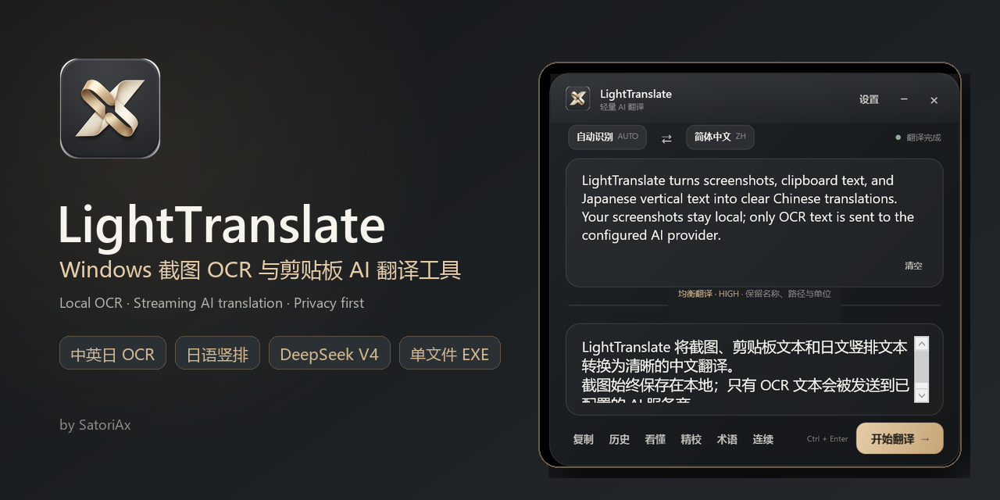
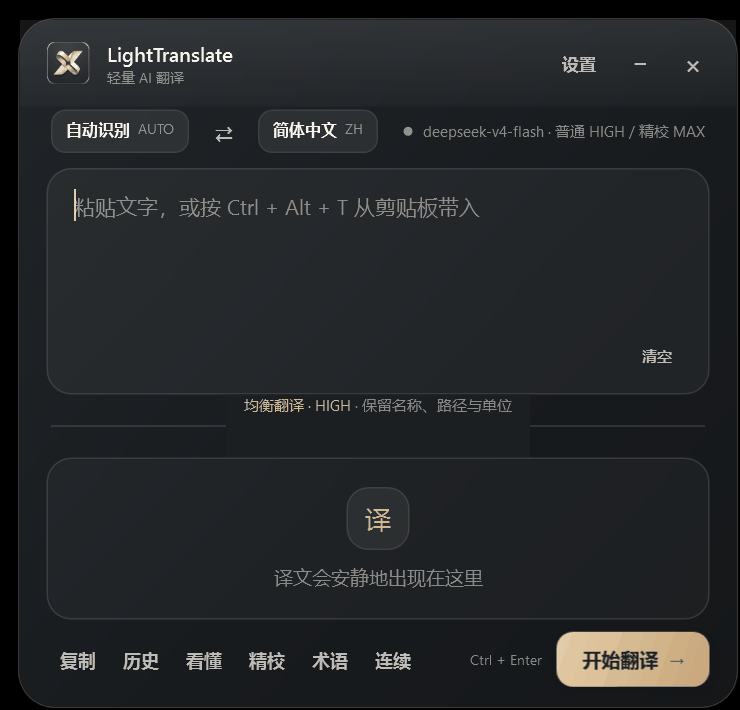
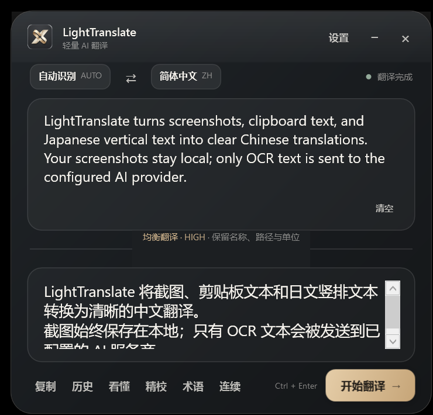

<p align="center">
  
</p>

<p align="center">
  <strong>轻量、安静、准确的 Windows 截图 OCR 与剪贴板 AI 翻译工具。</strong><br />
  Local-first Windows screenshot translator with Chinese / English / Japanese OCR, streaming AI translation and privacy-first storage.
</p>

<p align="center">
  <a href="https://github.com/SatoriAx/LightTranslate/releases/latest"></a>
  <a href="https://github.com/SatoriAx/LightTranslate/releases"></a>
  
  
  <a href="LICENSE"></a>
</p>

<p align="center">
  <a href="https://github.com/SatoriAx/LightTranslate/releases/latest/download/LightTranslate-windows-x64.exe"><strong>下载最新单文件版</strong></a>
  ·
  <a href="#使用方法">使用方法</a>
  ·
  <a href="#隐私与安全">隐私与安全</a>
  ·
  <a href="#english">English</a>
</p>

<p align="center">
  
</p>

---

## 为什么做 LightTranslate

很多翻译软件逐渐变成了带账号、会员、文档中心和大量设置的综合平台。LightTranslate 只保留一条清晰路径：

> **拿到文字 → 本地识别 → AI 翻译 → 复制结果。**

它适合游戏界面、视频字幕、日语软件、网页报错、聊天消息和任何无法直接复制的屏幕文字。截图留在本机，只有 OCR 识别后的文本会发送给你配置的 AI 服务。

<table>
<tr>
<td width="25%"><strong>📷 截图翻译</strong><br />快捷键框选屏幕区域，本地 OCR 后流式翻译。</td>
<td width="25%"><strong>📋 剪贴板翻译</strong><br />复制文字后快速带入，无需切换到浏览器。</td>
<td width="25%"><strong>縦 日语竖排</strong><br />PP-OCRv5 中英日统一识别，重建日语竖排阅读顺序。</td>
<td width="25%"><strong>🔒 隐私优先</strong><br />截图不上传，API Key 使用 Windows DPAPI 加密。</td>
</tr>
</table>

## 功能

### 翻译入口

- **手动输入翻译**：粘贴或编辑原文，`Ctrl + Enter` 开始翻译
- **剪贴板翻译**：`Ctrl + Alt + T` 读取剪贴板文字
- **截图 OCR 翻译**：`Ctrl + Alt + X` 框选当前屏幕区域
- **重复上次选区**：`Ctrl + Alt + R` 重新识别固定位置
- **固定选区连续翻译**：`Ctrl + Alt + F` 监听游戏对白、慢速字幕或状态面板

### 本地 OCR

- 内置 **PP-OCRv5 Mobile** ONNX 模型
- 中文、英文、日语统一识别
- 支持日语假名、汉字混排及竖排文本
- 低置信度或小文字时自动执行增强识别，并与原图结果择优
- OCR 模型首次使用时释放到本地校验缓存，损坏会自动恢复

### AI 翻译

- 支持 OpenAI-compatible Chat Completions 接口
- 推荐使用 **DeepSeek 官方 `deepseek-v4-flash`**
- 普通、截图、剪贴板和连续翻译使用 `reasoning_effort=high`
- **看懂**与**精校**使用 `reasoning_effort=max`
- 全模式保持 thinking enabled，并以 SSE 流式显示结果
- 60 秒无流数据自动中止，支持主动取消与失败重试

### 辅助能力

- **看懂**：用简洁中文解释原文含义、语气、歧义和必要背景
- **精校**：结合原文修正当前译文的误译、漏译与术语不一致
- **个人术语表**：只在原文实际命中时注入指定译法
- **最近记录**：本地保存最近 20 条文字记录，不保存截图
- **自动复制**：可选在翻译完成后自动复制结果
- **系统托盘**：关闭窗口后安静驻留；连续翻译开启时图标显示绿色状态点

## 下载

前往 [Releases](https://github.com/SatoriAx/LightTranslate/releases/latest) 下载：

```text
LightTranslate-windows-x64.exe
```

- Windows 10 / 11 x64
- 单文件、免安装
- 双击运行，关闭按钮默认收起到系统托盘
- 需要 [.NET 10 Desktop Runtime](https://dotnet.microsoft.com/download/dotnet/10.0)

> EXE 约 50 MB，主要体积来自本地 ONNX Runtime 与 PP-OCRv5 模型。模型内嵌在单文件中，第一次使用 OCR 时会自动准备本地缓存。

## 使用方法

### 1. 配置 AI 接口

打开右上角 **设置**，填写：

| 字段 | DeepSeek 官方示例 |
| --- | --- |
| Base URL | `https://api.deepseek.com` |
| Model | `deepseek-v4-flash` |
| API Key | 在 DeepSeek 控制台申请的 Key |

点击 **测试连接**。Key 会使用当前 Windows 用户的 DPAPI 加密，不会写入源码、EXE 或普通 JSON。

也可以配置其他兼容 OpenAI Chat Completions 的服务，但需要支持当前请求参数与 SSE 流式响应。

### 2. 开始翻译

| 快捷键 | 功能 |
| --- | --- |
| `Ctrl + Alt + T` | 读取剪贴板文字 |
| `Ctrl + Alt + X` | 框选截图并翻译 |
| `Ctrl + Alt + R` | 重复上次截图区域 |
| `Ctrl + Alt + F` | 开启或停止固定选区连续翻译 |
| `Ctrl + Enter` | 翻译当前原文 |
| `Esc` | 取消请求、收起窗口或取消框选 |

<p align="center">
  
</p>

## 隐私与安全

```text
屏幕截图 ──本机──> PP-OCRv5 ──识别文本──> 你配置的 AI API
               │
               └── 截图处理后删除，不上传、不写入历史
```

- 无账户系统、无广告、无遥测、无云同步
- 截图只在本机进行 OCR
- 只向 AI 服务发送 OCR 文本或手动输入文字
- API Key 使用 Windows CurrentUser DPAPI 加密
- 设置、历史、术语和密钥采用临时文件写入、安全替换与备份恢复
- 损坏 JSON 会隔离为 `.corrupt-*`，可从 `.bak` 自动恢复
- 本地日志只记录异常，不记录 API Key

本地数据目录：

```text
%APPDATA%\LightTranslate
```

OCR 缓存目录：

```text
%LOCALAPPDATA%\LightTranslate\ocr-cache\v5
```

## 技术栈

| 层 | 技术 |
| --- | --- |
| 桌面 UI | WPF · .NET 10 LTS |
| 截图 | Win32 / System.Drawing · PerMonitorV2 DPI |
| OCR | RapidOcrNet · PP-OCRv5 Mobile · ONNX Runtime |
| 图像处理 | SkiaSharp / System.Drawing |
| AI | OpenAI-compatible Chat Completions · SSE streaming |
| 密钥 | Windows DPAPI CurrentUser |
| 发布 | Windows x64 framework-dependent single-file EXE |

## 项目结构

```text
LightTranslate/
├─ MainWindow.*                 主翻译窗口
├─ CaptureOverlayWindow.*       截图框选层
├─ TranslationService.cs        AI 请求与 SSE 流解析
├─ OcrService.cs                OCR 与阅读顺序重建
├─ OcrModelStore.cs             内嵌模型释放与 SHA-256 校验
├─ SecretStore.cs               DPAPI 密钥存储
├─ AtomicFileStore.cs           设置与历史的原子写入/恢复
├─ History* / Terminology*      历史和术语
├─ assets/                      正式图标资源
└─ models/v5/                   PP-OCRv5 模型与字典
```

## 从源码构建

需要 Windows x64 与 [.NET 10 SDK](https://dotnet.microsoft.com/download/dotnet/10.0)：

```powershell
dotnet restore
dotnet build -c Release
dotnet publish -c Release
```

发布目录中只会生成一个 `LightTranslate.exe`。OCR 模型会作为嵌入资源打入 EXE。

## 当前限制

- 截图框选限制在鼠标当前所在显示器，不支持一个选区横跨多台显示器
- 固定选区连续翻译采用串行请求，优先保证准确度，不适合追逐高帧率字幕
- 未签名的个人项目 EXE 可能触发 Windows SmartScreen 提示
- 实际翻译速度受 AI 服务商负载、网络和 reasoning effort 影响

## License

[MIT](LICENSE) © 2026 SatoriAx

第三方组件及模型许可见 [THIRD_PARTY_NOTICES.md](THIRD_PARTY_NOTICES.md)。

---

<a id="english"></a>

## English

**LightTranslate** is a lightweight Windows screenshot OCR translator and clipboard AI translator built with WPF and .NET 10.

- Local PP-OCRv5 recognition for Chinese, English and Japanese
- Japanese vertical-text reading-order reconstruction
- Screenshot, clipboard, manual input and repeated-region translation
- Streaming DeepSeek V4 Flash translation with HIGH / MAX effort routing
- DPAPI-encrypted API keys, local history and terminology
- No account, ads, telemetry or screenshot upload
- Single portable Windows x64 EXE

Download the latest build from [GitHub Releases](https://github.com/SatoriAx/LightTranslate/releases/latest).

Keywords: Windows screenshot translator, OCR translator, clipboard translator, Japanese OCR, vertical Japanese text OCR, DeepSeek translator, PP-OCRv5 desktop app, local-first translation tool.
